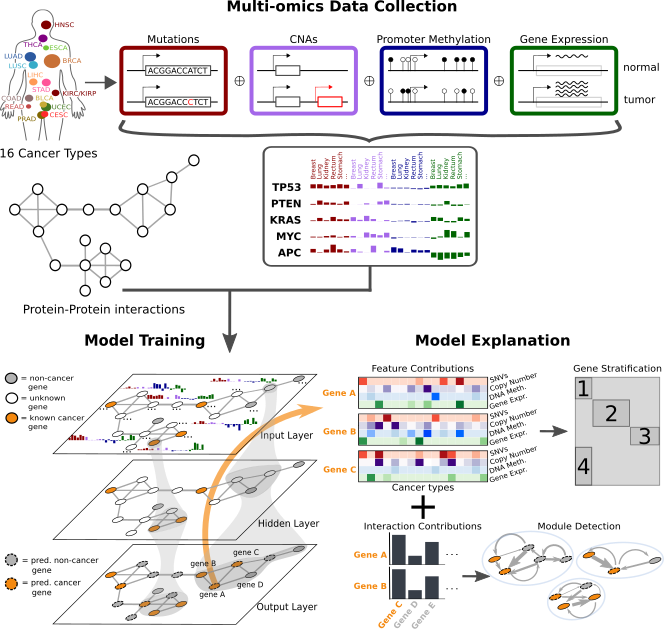

# EMOGI: Explainable Multi-Omics Graph Integration
[](https://www.gnu.org/licenses/gpl-3.0)

This project predicts cancer genes based on multi-omics feature vectors and protein-protein interactions. Each gene is a data point/node and semi-supervised graph convolutional networks are used for classifying cancer genes.
The following depicts a broad overview over the EMOGI method.



## Reproducibility
The analyses from the paper can be entirely reproced. Several notebooks in the analysis directory allow you to generate all results and the [postprocessing](EMOGI/postprocessing.py) script computes ROC and PR curves for EMOGI and competing methods if set up correctly. Please note that you might need the datasets indicated below to properly reproduce all results. To re-train the models, please have a look at the respective section in this README. The existing models also contain the HDF5 containers used for training.

## Installation & Dependencies
The code is written in Python 3 and was mainly tested on Python 3.6 and a Linux OS but should run on any OS that supports python and pip. Training is faster on a GPU (which requires the `tensorflow-gpu` instead of the normal `tensorflow` package) but works also on a standard computer.

EMOGI has the following dependencies:
* gcn (https://github.com/tkipf/gcn)
* Numpy
* Pandas
* Tensorflow
* h5py
* Networkx
* deepExplain (for an implementation of LRP, https://github.com/marcoancona/DeepExplain)
* mygene (for mapping of gene IDs)

For plotting and correct functioning of all the notebooks, you additionally might need:
* Matplotlib
* Seaborn
* Sklearn
* Scipy
* Goatools (for pathway enrichment)
* UMAP (for dimension reduction)
* UpSetPlot (for  visualization of overlaps between datasets/predictions beyond Venn diagrams)

Installing all of the packages should take roughly 10 minutes.
To install the gcn package, you have to clone and install the gcn package using:
```
git clone https://github.com/tkipf/gcn.git
cd gcn
python setup.py install
```
The other packages can be mostly installed using pip (some are dependenies of others, so no need to install them separately).
Use the following commands to install all required packages (if you don't have root access on your machine, try the `--user` option of pip):
```
pip install tensorflow==1.15.3 h5py mygene matplotlib matplotlib-venn seaborn umap-learn goatools UpSetPlot
pip install -e git+https://github.com/marcoancona/DeepExplain.git#egg=deepexplain
```
To verify a successful setup, you can check out our [toy example](example/README.md).

## Using EMOGI with Existing Models
The models that we used in the paper can be downloaded at: http://owww.molgen.mpg.de/~sasse/EMOGI/.
Those models can be used to compute LRP contributions and plots like performance comparisons can be done using the postprocessing script in the EMOGI directory.

## Computing Contributions for Genes of Interest
A trained EMOGI model can be interrogated in a gene-wise fashion to find out why the algorithm considered a gene a cancer gene or not.
To compute the feature and interaction partner contributions for a gene of interest, use:
```
python lrp.py -m <path-to-model-directory> -g <hugo-symbol1> <hugo-symbol2> -b True/False
```
The genes have to be provided as hugo gene symbols, eg. `EGFR` or `BRCA1`. The `-b` option controls if the resulting plots are heatmaps (more compact, as shown in the paper) or more informative barplots whose error bars indicate standard deviation across cross-validation runs.
Finally, to compute the contributions for all genes (~13,000 to 15,000 depending on the PPI network used), you can specify the `-a` option. This will take multiple days, however, and uses all available cores.
The output, located in a directory called `lrp_sigmoid` under the model directory, consists of a pdf file, displaying the multi-omics input feature vector, LRP feature contributions, the most important LRP interaction partner contributions and the multi-omics contributions of the three most important interaction partners for the gene of interest. The multi-omics contributions from the interaction partners are still from the point of view of the gene of interest and indicate that a certain omics feature in a cancer type *of an interacting gene* was important for the classification of the gene of interest.
A second file contains an edgelist file of interaction partners of the gene of interest, readable in Cytoscape or similar programs.
Run time for a single gene should be around one to two minutes, depending on the number of cores available.
*Note: The LRP script is often better not executed on GPU because it doesn't benefit from it and uses a lot of space.*

## Training EMOGI with Your Own Data
To train EMOGI with your own data, you have to provide a [HDF5](https://www.h5py.org/) container containing the graph, features and labels. There are scripts in `pancancer/preprocessing` that help with the contruction of the container. In general, a valid container for EMOGI has to contain a graph (called `network`, a numpy matrix of shape N x N), a feature matrix for the nodes (called `features`, of shape N x p), the gene names and IDs (called `gene_names`, as numpy array, dtype `object`), the training set (called `ỳ_train`, as boolean indicator array of shape N x 1), the test set of the same shape (called `y_test`), training and test masks (called `train_mask` and `test_mask`, again, indicator arrays of shape N x 1) and the names of the features (called `feature_names`, an array of length p). Optionally, the raw features can also be added to aid biological interpretation when analyzing the LRP plots (called `features_raw`, the first row plots the input features and it might be better to plot unnormalized values).

Once you obtained a valid HDF5 container, you can simply train EMOGI with
```
python train_EMOGI_cv.py -d <path-to-hdf5-container> -hd <n_filters_layer1> <n_filters_layer2>
```
where the `-hd` argument specifies the number of graph convolutional layers (the number of arguments) and the number of filters per layer. Training with `-hd 100 50` for instance implies that EMOGI is trained with 2 graph convolutional layers with 100 and 50 filters.

In case you want to only train a single model without cross-validation, you can use `train_EMOGI.py` instead with similar parameters. Use the `--help` option for an overview of parameters for training.

For the perturbation experiments in the paper, we used the `train_all_omics.py` script which essentially trains EMOGI models with the same hyper-parameters on a directory of HDF5 containers. See again the `help` option or the other training scripts for details on the parameters.

To conduct a gridsearch to find suitable combinations of hyper-parameters, use the `gridsearch.py` script but note, that the combinations are hard-coded into the python file. Other than that, the script should be fairly easy to use. Furthermore, [this](analysis/evaluate_gridsearch.ipynb) notebook contains  basic analysis to choose a good setting from a successful gridsearch.

To produce basic plots of performance, a prediction for every gene and a comparison with the competing methods, run the `postprocessing.py` script:
```
python postprocessing.py -m <path-to-model-directory> -n <name-of-ppi-network> -nm True/False
```
The name of the PPI network can be any of `CPDB`, `Multinet`, `PCNet`, `STRING`, `IRef` or `IRefNew` and is case-insensitive. The `-nm` argument specifies if several network measures, such as betweenness centrality, clustering coefficient, degree and others should be included in the comparison to other methods.
Beware that the paths to several datasets are hard-coded in the beginning of the script. If you downloaded these datasets, please correct the paths accordingly.

## Preparing Your Own Data for Use with EMOGI
See the [readme file in pancancer](pancancer/README.md) for explanations on how you can process your own data and prepare it for EMOGI training.

## Additional datasets
We used various different data sets from the community to train and validate EMOGI. For deriving positive and negative labels, as well as for functional validation and relationships to other cancer gene sets, a diverse set of data sets were used. Links to the databases and publications can be found below. Ideally, the jupyter notebooks in this repository contain a data section in the beginning where you can exchange the paths with your own copies of the files. Furthermore, some crucial scripts (such as postprocessing and computation of LRP) will work but not produce all of the plots if certain datasets are not available.

### Network of Cancer Genes (NCG) version 6.0
We downloaded the file from the preprint. The data is available here:
http://ncg.kcl.ac.uk/cancer_genes.php and we downloaded everything together from http://ncg.kcl.ac.uk/download_file.php?file=cancergenes_list.txt
### COSMIC Cancer Gene Census (CGC) v91
https://cancer.sanger.ac.uk/cosmic/download
### KEGG Cancer pathways:
https://www.gsea-msigdb.org/gsea/msigdb/cards/KEGG_PATHWAYS_IN_CANCER.html
### DigSEE:
http://210.107.182.61/digseeOld/
### Achilles Cancer Depencency Map
https://ndownloader.figshare.com/files/22629068
### OMIM
https://omim.org/downloads
### OncoKB
https://www.oncokb.org/cancerGenes
### ONGene
http://ongene.bioinfo-minzhao.org/ongene_human.txt
### GSEA Cancer Data sets
https://www.gsea-msigdb.org/gsea/msigdb/collections.jsp#C4
### Computationally derived cancer modules:
https://www.gsea-msigdb.org/gsea/msigdb/download_file.jsp?filePath=/msigdb/release/7.1/c4.cm.v7.1.symbols.gmt
### Computationally derived neighborhoods of cancer genes:
https://www.gsea-msigdb.org/gsea/msigdb/download_file.jsp?filePath=/msigdb/release/7.1/c4.cgn.v7.1.symbols.gmt
### Bailey et al.
Table S1 from https://www.cell.com/cms/10.1016/j.cell.2018.02.060/attachment/cf6b14b1-6af1-46c3-a2c2-91008c78e87f/mmc1.xlsx
