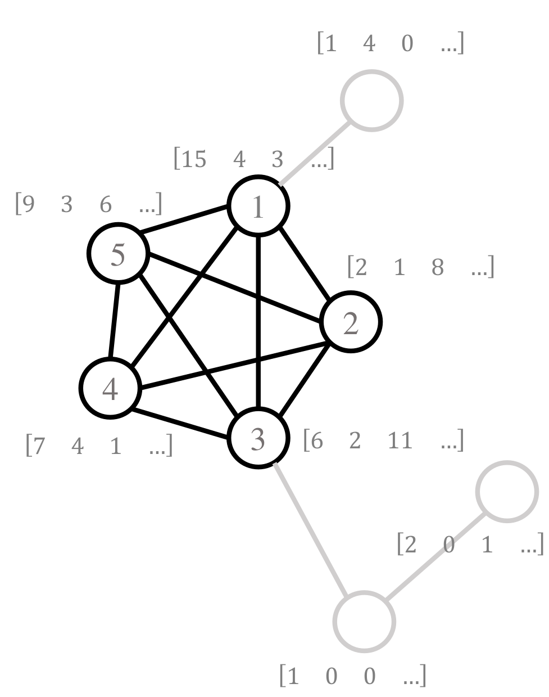

# Simulation & Perturbation of EMOGI
In order to assess which of the input data is important for EMOGIs classifications, we eused simulations and perturbation
experiments. Simulations make use of [NetSim](https://github.com/schulter/NetSim) to simulate artificial networks with
biological characteristics (power-law node degree distribution and the like) and implant graph motifs in those networks.
This way, the performance of EMOGI recovering these graph modules can be evaluated.

## Simulation
[This notebook](EMOGI_preprocessing_NetSim_modules.ipynb) copmutes a HDF5 container with random feature vectors for the nodes
following different gaussian distributions. The values in the graph motifs get values from one distribution while the rest
gets values from the other one. The closer those two distributions are, the harder it becomes to classify based on features
alone and the graph structure becomes more important.

